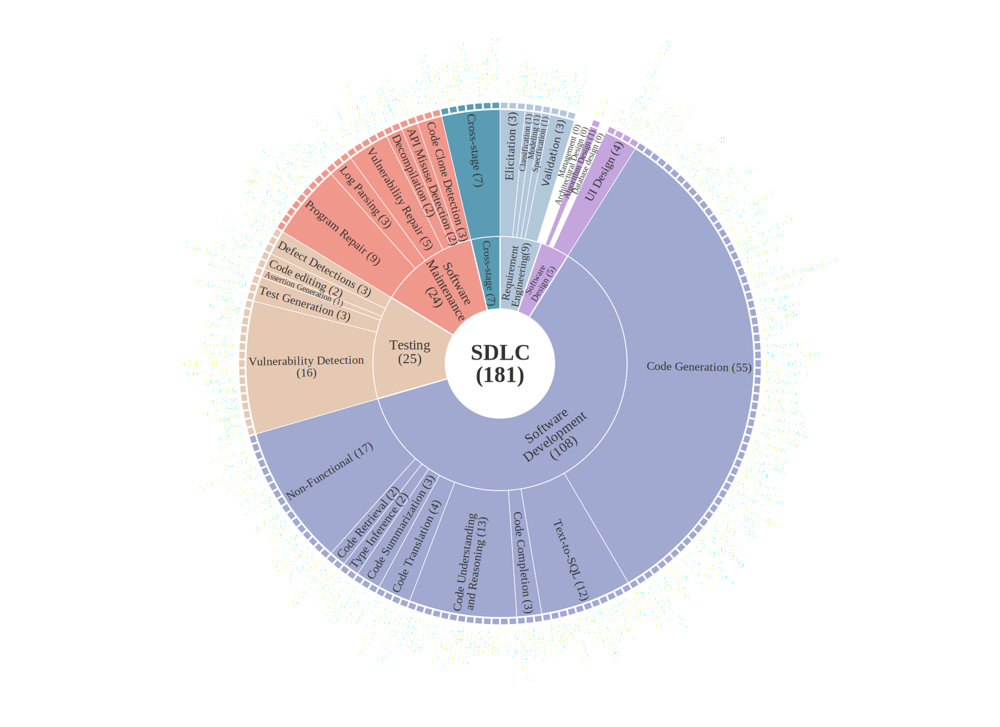

 
## TL;DR
This paper provides a comprehensive review of existing Code Large Language Models (CodeLLMs) and associated proxy benchmarks, systematically analyzing 181 benchmarks drawn from 461 relevant publications. These benchmarks span different stages of the Software Development Lifecycle (SDLC).
This repository serves as supplementary material by offering the complete citation library of surveyed literature alongside detailed information on all the benchmarks investigated.
## Repo Structure
```                 
- Supplimental_Materials/
    - 181benchmarks.bib
    - 461survey-papers.bib
    - SDLC-Benchmarks.xlsx
- README.md
```

## BibTeX Reference Libraries
- 181benchmarks.bib: Contains academic publications related to 181 benchmarks within the individual stages of the software development lifecycle.

- 461survey-papers.bib: Comprises 461 high-quality survey papers on the application of Large Language Models (LLMs) in Software Engineering, selected according to the following criteria, including those related to the aforementioned 181 benchmarks:
    - Research on the application of LLMs in software engineering.
    - Priority is given to papers accepted by influential journals (e.g., TOSEM, TSE, IJCN, JMLR, TDSC, TOCHI) and conferences (e.g., ICSE, ASE, FSE, ACL, ICML, IJCAI, ISSTA, NeurIPS, PLDI, SIGKDD, S&P, CHI).
    - The selection of publications on arXiv is based on two key criteria, namely the quality of the paper and the reputation of the author.
    - Papers published after 2022. 
    - All papers that propose code-related benchmarks are directly included in the scope of this survey.

## SDLC-Benchmarks.xlsx
This Excel file provides detailed information on 181 benchmarks, divided into six worksheets corresponding to different stages of the Software Development Lifecycle (SDLC):
- Requirement Engineering  
- Software Design  
- Software Development  
- Testing  
- Software Maintenance  
- Cross-phase
Each benchmark includes the following fields: Name, Programming Language, Paper Title, Year, Task, Phase, Innovative, and Composition details.